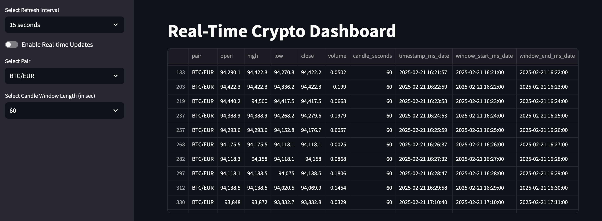
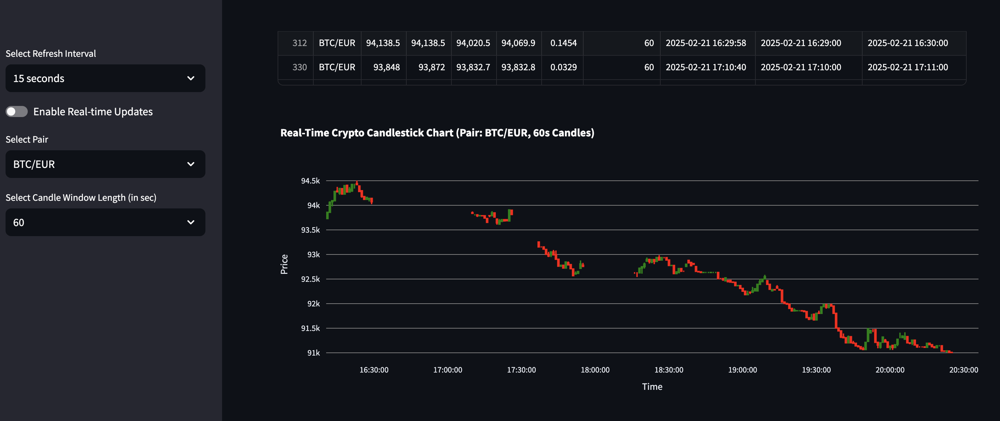

# Real Time Crypto Dashboard


A real-time cryptocurrency dashboard that ingests live data from the [Kraken WebSocket API](https://docs.kraken.com/api/), processes it into OHLC (Open, High, Low, Close) candlestick data using Kafka, and stores it in a [Hopsworks Feature Store](https://www.hopsworks.ai/). The processed data is then visualized in an interactive [Streamlit](https://streamlit.io/) dashboard. This project serves as a foundation for further extensions, such as predictive analytics or news ingestion.




## Features

- **Real-Time Data Ingestion**: Streams live crypto data from Kraken via WebSocket.
- **Data Processing**: Converts raw trades into OHLC candles using Kafka.
- **Feature Store**: Persists historical and real-time data in Hopsworks.
- **Visualization**: Displays candlestick charts in a Streamlit dashboard.
- **Tooling**: Built with modern Python tools like `uv` for dependency management and `ruff` for linting/formatting.

## Getting Started

### Prerequisites

- Python 3.10+
- [Docker](https://www.docker.com/) (for containerized services)
- [uv](https://github.com/astral-sh/uv) (for dependency management)
- A Kraken API key (optional for authenticated WebSocket features)
- A Hopsworks account and API key

### Setup

1. Clone the Repository

```bash
git clone https://github.com/mvoss02/real_time_crypto_dashboard.git
cd real_time_crypto_dashboard
```

2. Initialize a service

```bash
cd services
uv init SERVICE_NAME
```

3. Add ruff with uv:

```bash
uv tool install ruff
```

4. Add pre-commit:

In addition, one needs to add

```bash
uv tool install pre-commit
```

5. In order to automatically run pre-commit hooks add the
   following to files (search for files to your liking on the web):

- .pre-commit-config.yaml
- ruff.toml

6. Install pre-commit hooks:

```bash
pre-commit install
```

7. Install Hopsworks

```bash
uv pip install "hopsworks[python]"
```

8. Packages

8.1. Creating a package

```bash
uv init --lib MY_PACKAGE_NAME
```

8.2. Building a package

```bash
uv build
uv pip install pip install dist/MY_PACKAGE_NAME-0.1.0-py3-none-any.whl
```

8.3. Install package in development mode -> does not have to be re-installed with every change made

```bash
uv pip install -e .
```

### Usage

One can run each service individually or instead (the easier approach) use the docker-compose YAML files to, either:

1. Backfill data for a given number of days:

```bash
make backfill-data
```

2. Run the live data ingestion (including the dashboard)

```bash
make start-dashboard-pipeline-live
```

In order for this to work, Redpanda needs to be running:

```bash
make start-redpanda
```
